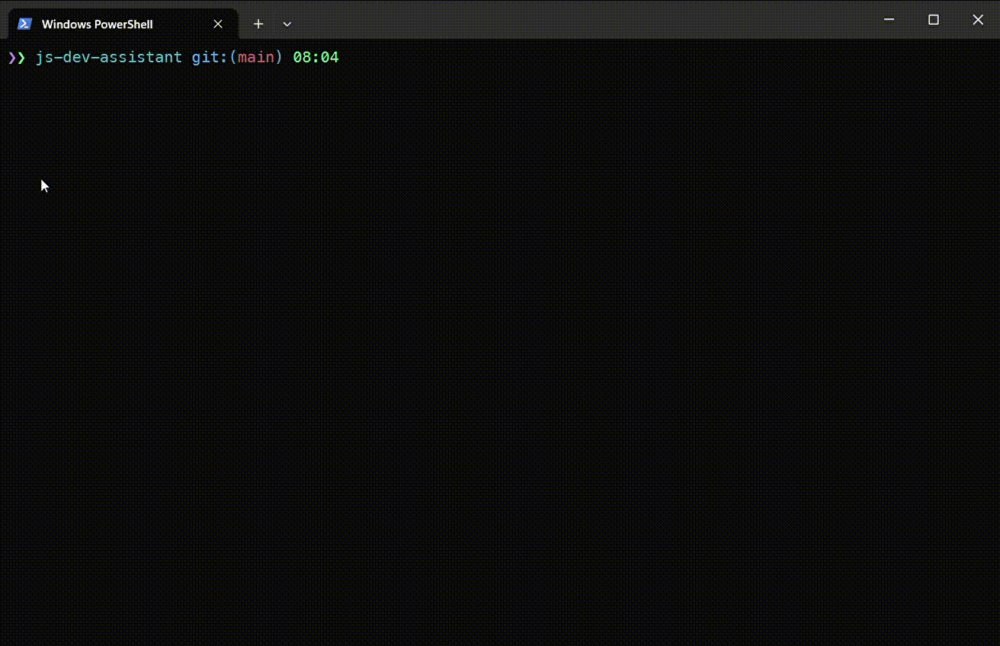
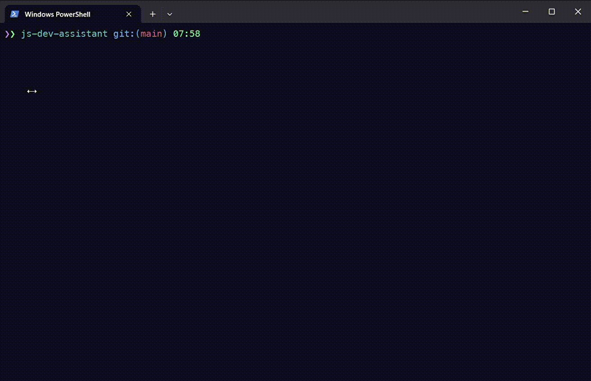
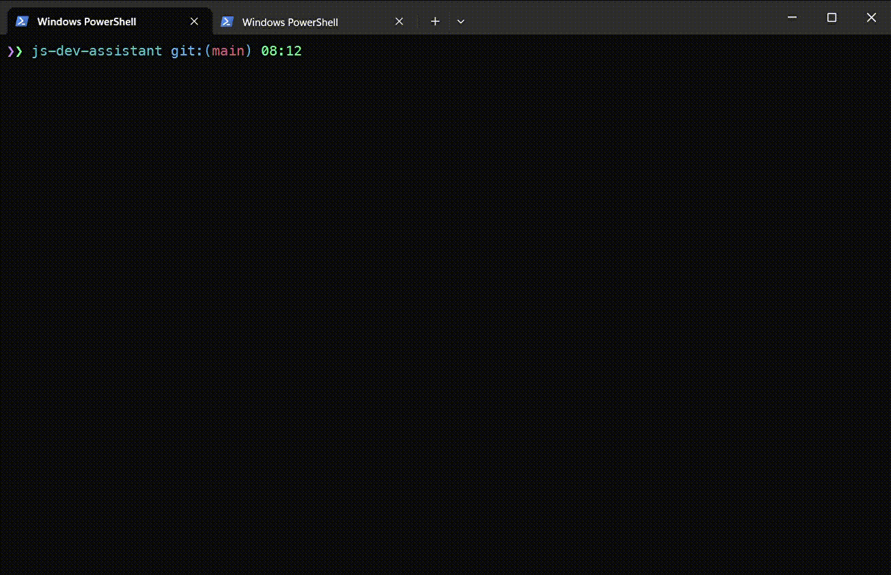
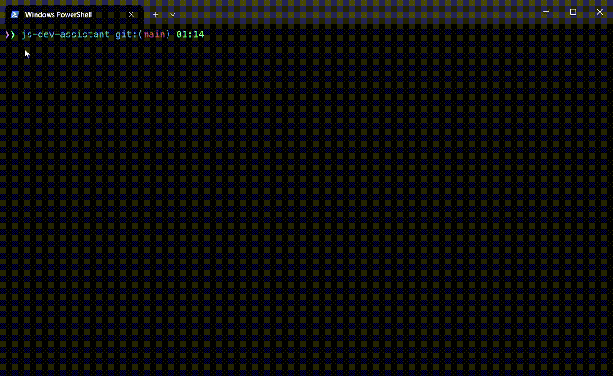
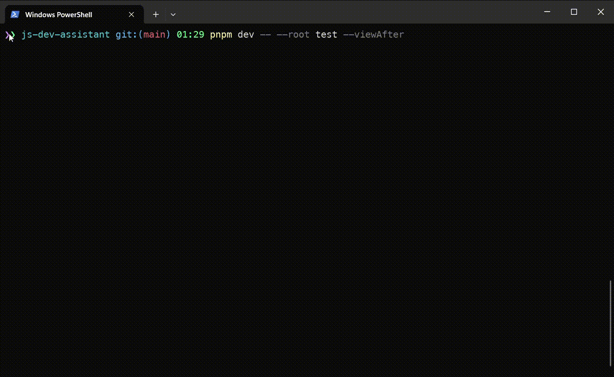

## Features

### Append item to array

You can add new item to array variable by choosing target variable from list and typing value that you want to add.

### Remove items from array

This feature allows you interactively select desired target variable from list of array variables and choose items you want to remove using arrow keys and selecting/unselecting items by pressing `space`.

### Add key-value to object

You can add key/value pair to object by selecting target variable from list and specify key and value in corresponding prompts

### Hook
There is the `--hook` option to specify some hook as a shell command you want to perform when manipulation have been performed.
You can specify, for example `npm test`, `prettier --write .` or some other hook.

### View after manipulation

There is the `--viewAfterManipulation` option to display a file content after manipulation to inspect changed file.

#### Tips

There are handy aliases available: `--viaf`, `--thenView`, `viewAfter`.
