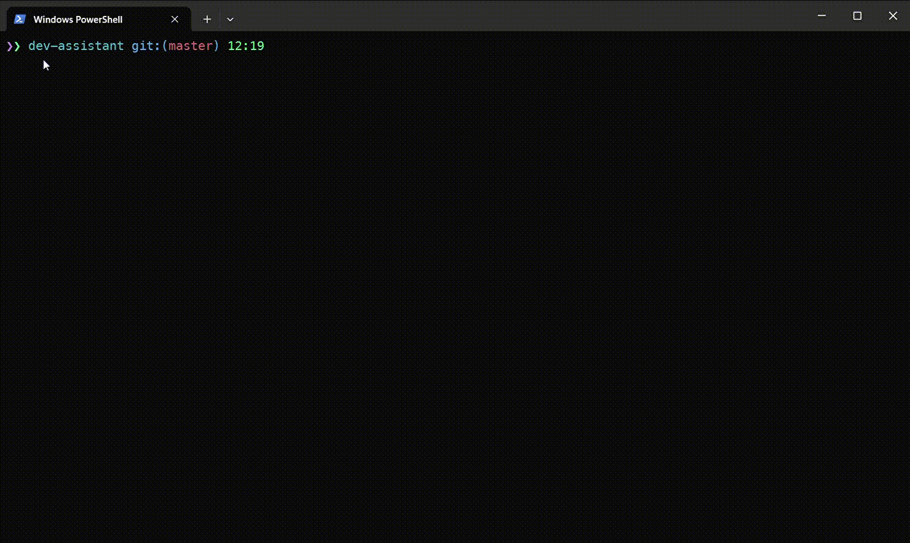

# js-dev-assistant [![NPM version][npm-image]][npm-url]

> CLI refactor code for JavaScript developers

## Install

```bash
$ npm install --global js-dev-assistant
```

## CLI

```
    $ js-dev-assistant --help

    Manipulate over source files - refactor, view, etc. not leaving a terminal (js-dev-assistant v1.0.0)

    USAGE js-dev-assistant [OPTIONS] [COMMAND]

    ARGUMENTS

    COMMAND    An optional command name (refactor, view...), will be prompted interactively if not provided

    OPTIONS

        --root    Root folder to search files on
    -f, --file    source file name
```

You can provide a command name and file when issuing a command or by choosing from interactive prompts.
Filename also can be choosen from interactive prompt, or you can use --file option to specify source file.

Notes:

You can use the following convenient aliases (instead of `js-dev-assistant`): `dev-assistant`, `devasis`, `deva`, `refactorer`.

In view mode you can:

- scroll a content using arrow keys
- press `Ctrl+C` or `q` key in the keyboard in order to exit from program

## Demo


## Individual features

### Refactor variable



### Refactor variable


### View file


## License

MIT © [Rushan Alyautdinov](https://github.com/akgondber)

[npm-image]: https://img.shields.io/npm/v/js-dev-assistant.svg?style=flat
[npm-url]: https://npmjs.org/package/js-dev-assistant
